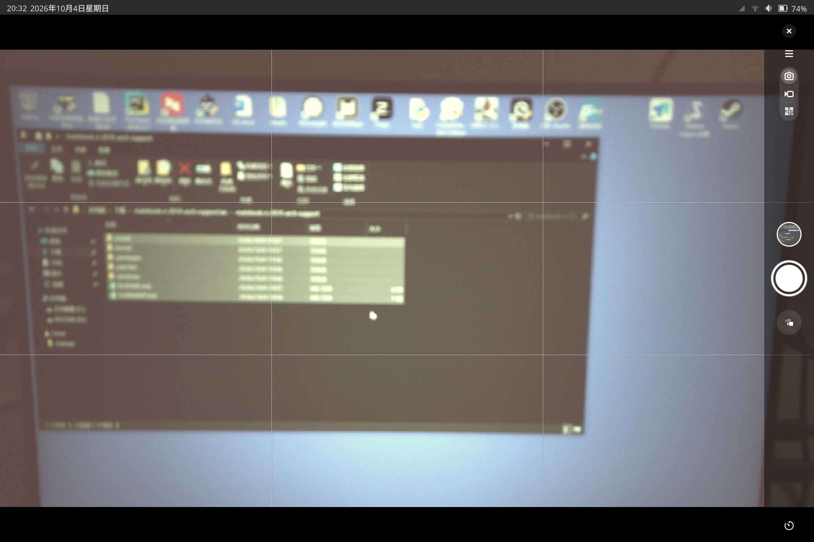

# MateBook E 2019 (PAK-AL09 / sdm850) — Arch Linux ARM 支持包

给同型号机器的可直接套用补丁集。详见 [SUMMARY.md](SUMMARY.md)

**TODO**
1. 修复Gnome Snapshot中后置摄像头取景无法对焦和颜色问题
  

## 结构

```
SUMMARY.md                 全部改动的总清单（含原理、已知限制）
install/                   一键安装（脚本 + systemd + udev）
  install-all.sh           装用户态全部改动
  install-camera-portal.sh 装 pipewire-libcamera（让 Snapshot 看到摄像头）
  rebuild-dtb.sh           给运行中的 DTB 补相机电源域
  set-static-ip.sh         固定 IP
  90-iio-sensor-proxy-ssc-accel.rules   加速度计挂载矩阵
  planck-*.sh / *.service  EC 唤醒、合盖、矩阵调参
packages/                  可 makepkg 的 Arch 包
  planck-autobrightness/   自动亮度
  planck-camera-capture/   后摄抓图
  iio-sensor-proxy-ssc/    修好的 iio-sensor-proxy（libssc 加速度计）
  libcamera-sensor-helper/ 带 gc5025/s5k3l6xx helper 的 libcamera
patches/
  kernel/                  内核/DTS 补丁
  userspace/               用户态补丁（iio-sensor-proxy / libcamera / bluez-qt）
kernel/                    内核打包（PKGBUILD + README + 现成 linux-image.deb）
windows/                   从华为 Windows 驱动提取的原始配置（传感器/相机/DSDT）
```

## 快速开始（同型号机器）

```sh
sudo ./install/install-all.sh            # 用户态全部改动
sudo ./install/rebuild-dtb.sh /boot/<你的>.dtb   # 相机电源域（重启生效）
# 内核：见 kernel/README.md
# 相机 portal + libcamera helper：见上面两个 package 目录
```

## 已验证可用的功能

- 自动旋转（Always）、环境光自动亮度
- 音频（无削波）、蓝牙、s2idle 电源、合盖黑屏
- 设备自带传感器（加速度计/陀螺/光线）稳定
- 摄像头 **通路正常**（libcamera 能枚举、软件 ISP 就绪），但模组像素输出为
  硬件问题（见 SUMMARY 第三节）
